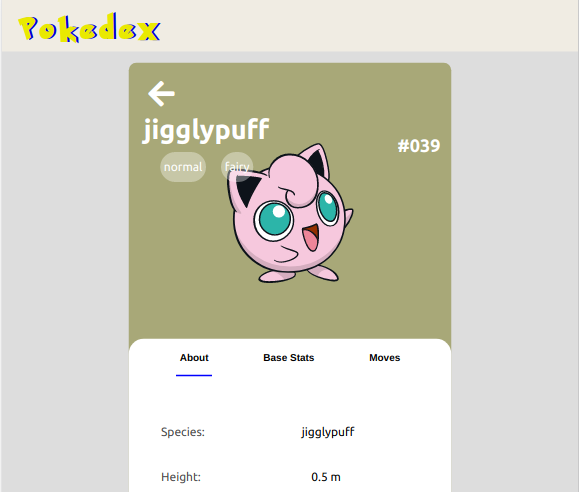

## Pokedex

That's my first project with React by myself, and I am very excited about this one.
I'm put in practice, states, events, life-cycle,components, props, etc. Until now I'm having a lot of fun with React, pretty good library, the dom manipulation with react is way more simple and faster.  

In these project I'm using PokeAPI, a RESTful API with a huge set of information about Pokemon, if you want to learn more about it [click here](https://pokeapi.co/). 

If you want to give it a try: [click here](https://gabriellima77.github.io/pokedex/)
