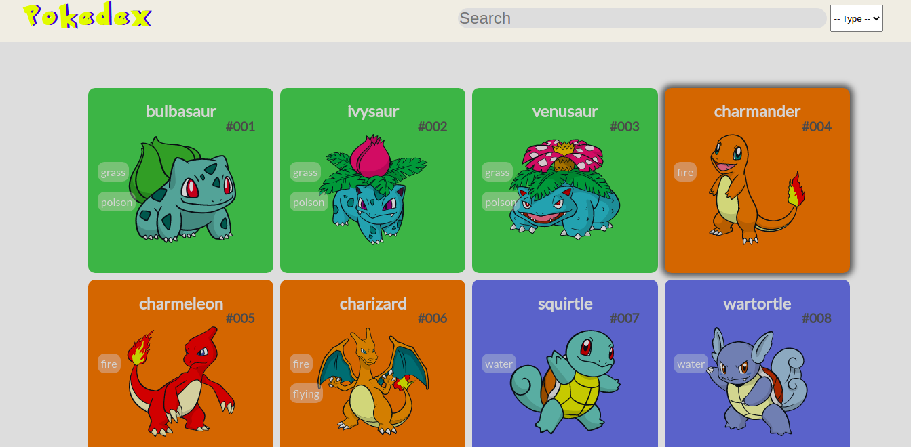
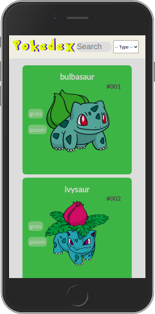
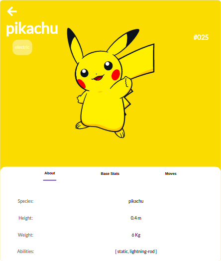
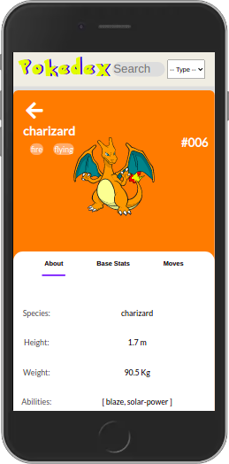

## Pokedex

That's my first project with React by myself, and I am very excited about this one.
I'm put in practice, states, events, life-cycle,components, props, etc. Until now I'm having a lot of fun with React, pretty good library, the dom manipulation with react is way more simple and faster. In this project I'm using PokeAPI, a RESTful API with a huge set of information about Pokemon  

## Demo

### Home Page

Desktop|Mobile
--------------------------------------|----------------------------------------------------
|  

### Card
Desktop|Mobile
-----------------------------|-------------------------------------------
|  

If you want to give it a try click the link below:  
[Live Demo](https://gabriellima77.github.io/pokedex/)

## Built with
- [React](https://reactjs.org/)
- [PokeAPI](https://pokeapi.co/)
